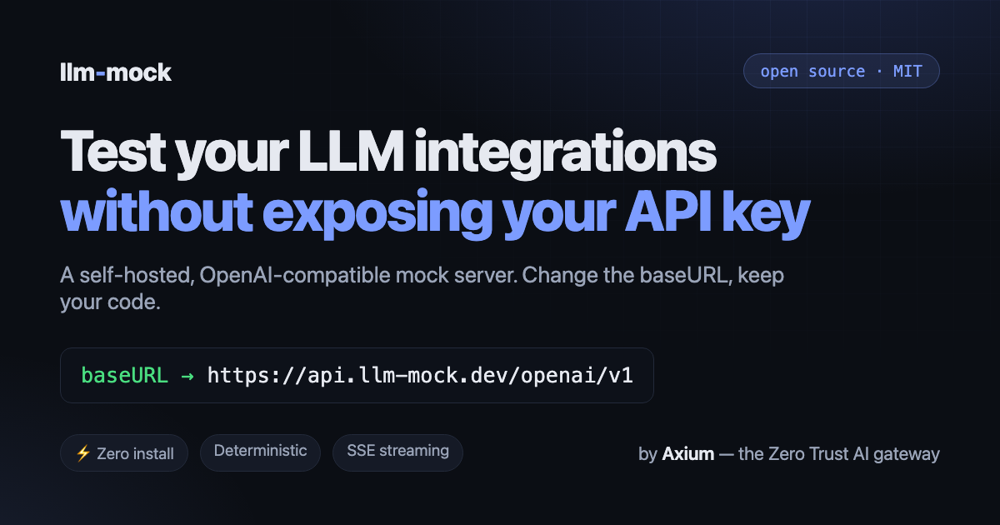

<p align="center">
  <a href="https://llm-mock.dev">
    
  </a>
</p>

# llm-mock

[](https://github.com/axium-lab/llm-mock/actions/workflows/ci.yml)
[](https://github.com/axium-lab/llm-mock/releases)
[](https://github.com/axium-lab/llm-mock/pkgs/container/llm-mock)
[](LICENSE)

**A drop-in mock of LLM provider APIs for integration tests and open source projects. Change the `baseURL`, keep your code.**

> **⚡ Zero install** — a free hosted instance runs at **[`api.llm-mock.dev`](https://api.llm-mock.dev)**. Point your SDK's `baseURL` there and start testing in seconds; no download, no signup. [Details ↓](#hosted-instance)

Testing an app built on an LLM SDK usually means one of two things: paying for real API calls in CI, or leaking an API key into a place it should never be (a public repo, a contributor's laptop, a CI log). llm-mock removes that choice. It is a tiny local server that speaks each provider's API contract — same endpoints, same response shapes, same error format, same SSE streaming — but with deterministic, configurable responses and no real key required. OpenAI is supported today; Anthropic, Gemini, and more are planned.

```ts
import OpenAI from "openai";

const client = new OpenAI({
  baseURL: "http://localhost:3000/openai/v1", // the only change in your app
  apiKey: "sk-mock-key-01",                   // any key from api-keys.json
});

const completion = await client.chat.completions.create({
  model: "gpt-4o",
  messages: [{ role: "user", content: "Hello!" }],
});

console.log(completion.choices[0].message.content); // "Echo: Hello!"
```

No mocking libraries, no request interception, no changes to your application code. The official `openai` SDK talks to llm-mock exactly as it talks to the real API — that compatibility is what the project's own test suite verifies.

## Hosted instance

Nothing to install: a free, shared instance runs at **`https://api.llm-mock.dev`**. Point any OpenAI SDK's `baseURL` at it and go:

```ts
const client = new OpenAI({
  baseURL: "https://api.llm-mock.dev/openai/v1",
  apiKey: "sk-mock-key-01",
});
```

It's a stateless mock meant for demos and CI — it holds no data and requires no signup, and it ships the same `sk-mock-key-01` … `sk-mock-key-10` keys. For custom keys, isolation, or offline use, run your own (below). See the full [API reference](https://llm-mock.dev/api.html).

## Features

- **OpenAI-compatible contract** — responses match the official API shapes, validated in CI with the official `openai` npm SDK as the client.
- **Streaming (SSE)** — `stream: true` works on chat completions (delta chunks + `data: [DONE]`) and on the Responses API (typed events: `response.created`, `response.output_text.delta`, `response.completed`, ...).
- **Deterministic and idempotent** — same request, same bytes: ids are content hashes, timestamps derive from them, embeddings are hash-seeded unit vectors. Snapshot-test friendly.
- **Stateless canned responses** — need a specific reply? Send it in the `x-llm-mock-response` header of the request itself. Nothing to register, nothing to clean up, and no server state: it behaves identically on a laptop, in CI, or behind a load balancer.
- **Real error flows** — invalid API keys, unknown models, and validation errors return the exact OpenAI error envelope, so you can test your error handling too.
- **Zero setup** — clone, `bun install`, `bun start`. The valid API keys ship in the repo.

## Quick start

Requires [Bun](https://bun.sh).

```bash
git clone https://github.com/axium-lab/llm-mock.git
cd llm-mock
bun install
bun start
```

```
llm-mock listening on http://localhost:3000
- openai: baseURL http://localhost:3000/openai/v1
10 valid API keys loaded from api-keys.json
```

Then point any OpenAI SDK at it:

```ts
const client = new OpenAI({ baseURL: "http://localhost:3000/openai/v1", apiKey: "sk-mock-key-01" });
```

```python
client = OpenAI(base_url="http://localhost:3000/openai/v1", api_key="sk-mock-key-01")
```

```bash
curl http://localhost:3000/openai/v1/chat/completions \
  -H "Authorization: Bearer sk-mock-key-01" \
  -H "Content-Type: application/json" \
  -d '{"model": "gpt-4o", "messages": [{"role": "user", "content": "ping"}]}'
```

### Run with Docker

No Bun installed? A prebuilt multi-arch image (amd64/arm64) is published on [GHCR](https://github.com/axium-lab/llm-mock/pkgs/container/llm-mock) with every release:

```bash
docker run --rm -p 3000:3000 ghcr.io/axium-lab/llm-mock
```

Available tags: `latest`, and `X.Y.Z` / `X.Y` per release (pin a version in CI, e.g. `ghcr.io/axium-lab/llm-mock:0.1.0`).

Or build it yourself from the repo:

```bash
docker build -t llm-mock .
docker run --rm -p 3000:3000 llm-mock
```

To use your own API keys file, mount it over the default one:

```bash
docker run --rm -p 3000:3000 -v ./my-keys.json:/app/api-keys.json:ro llm-mock
```

The image ships a `HEALTHCHECK`, so orchestrators (and `docker compose` `depends_on: condition: service_healthy`) know when the mock is ready.

## Provider support

llm-mock is designed to be multi-provider: each provider mounts under its own URL prefix and implements its own API contract. This is where each one stands today:

| Provider | Prefix | Status |
| --- | --- | --- |
| OpenAI | `/openai/v1` | ✅ Supported |
| Anthropic | `/anthropic` | 🔜 Planned |
| Gemini (AI Studio) | `/gemini` | 🔜 Planned |
| Gemini Enterprise (Vertex AI) | — | 🔜 Planned |
| Azure OpenAI | — | 🔜 Planned |

Want a provider prioritized? [Open an issue](https://github.com/axium-lab/llm-mock/issues) — or a PR (see [Contributing](#contributing)).

## Supported endpoints

OpenAI is the provider implemented today; these are its endpoints under the `/openai` prefix.

| Endpoint | Notes |
| --- | --- |
| `POST /openai/v1/chat/completions` | Full `chat.completion` object, `n` choices, SSE streaming, `stream_options.include_usage` |
| `POST /openai/v1/responses` | Full `response` object, typed SSE event stream |
| `GET /openai/v1/responses/{id}` | Stateless: synthesizes a deterministic response for any id |
| `DELETE /openai/v1/responses/{id}` | Idempotent; returns the OpenAI deletion object |
| `GET /openai/v1/models` | Simulated catalog (`gpt-4.1`, `gpt-4o`, `gpt-4o-mini`, `text-embedding-3-*`, ...) |
| `GET /openai/v1/models/{model}` | `404` in OpenAI error format for unknown models |
| `POST /openai/v1/embeddings` | Deterministic unit vectors, correct dimension per model, `dimensions` param, `float` and `base64` encoding |

Plus one mock-only utility endpoint outside any provider contract:

| Endpoint | Notes |
| --- | --- |
| `GET /health` | Healthcheck |

Parameters the mock does not simulate (`temperature`, `top_p`, `tools`, `response_format`, ...) are accepted without error, because real SDK clients send them.

## Authentication

llm-mock validates API keys against a closed set defined in [`api-keys.json`](api-keys.json), so you can test both the happy path and the failure path:

- **Valid keys**: `sk-mock-key-01` through `sk-mock-key-10` ship in the repo. Point the file somewhere else with `LLM_MOCK_API_KEYS_FILE` to use your own.
- **Invalid keys**: any other key — by convention use the documented `sk-mock-invalid` — returns the real OpenAI `401`:

```json
{
  "error": {
    "message": "Incorrect API key provided: sk-moc****alid. You can find your API key at https://platform.openai.com/account/api-keys.",
    "type": "invalid_request_error",
    "param": null,
    "code": "invalid_api_key"
  }
}
```

## Controlling responses

By default every completion echoes the last user message (`"Echo: <your prompt>"`), which is deterministic and lets tests assert that their exact prompt reached the server. When a test needs a specific reply, the request itself carries it in a header — nothing to register beforehand, nothing to clean up afterwards:

```ts
const completion = await client.chat.completions.create(
  { model: "gpt-4o", messages: [{ role: "user", content: "What's the weather like?" }] },
  { headers: { "x-llm-mock-response": "It is sunny in Valencia." } },
);
// completion.choices[0].message.content === "It is sunny in Valencia."
```

```python
completion = client.chat.completions.create(
    model="gpt-4o",
    messages=[{"role": "user", "content": "What's the weather like?"}],
    extra_headers={"x-llm-mock-response": "It is sunny in Valencia."},
)
```

HTTP headers cannot carry UTF-8 verbatim; for content beyond ASCII, base64-encode it into `x-llm-mock-response-base64` (which wins when both headers are present):

```ts
{ headers: { "x-llm-mock-response-base64": Buffer.from("Soleado — 30°C ☀️").toString("base64") } }
```

Because the canned response travels with the request, the server keeps no state at all: the same request always returns the same response, no matter which instance, replica, or restart serves it.

## Configuration

Everything is optional — llm-mock works out of the box. To override the defaults, set environment variables or copy [`.env.example`](.env.example) to `.env` (Bun loads it automatically, no dotenv needed).

| Environment variable | Default | Description |
| --- | --- | --- |
| `LLM_MOCK_PORT` (or `PORT`) | `3000` | Port to listen on |
| `LLM_MOCK_API_KEYS_FILE` | `api-keys.json` | Path to the JSON array of valid API keys |

## Using it in your test suite

Import the app factory directly and mount it on an ephemeral port — no separate process needed. This is exactly how llm-mock tests itself:

```ts
import OpenAI from "openai";
import { createApp } from "llm-mock/src/app";
import { loadApiKeys } from "llm-mock/src/core/api-keys";

const server = createApp({ apiKeys: loadApiKeys("api-keys.json") }).listen(0);
const { port } = server.address();
const client = new OpenAI({ apiKey: "sk-mock-key-01", baseURL: `http://127.0.0.1:${port}/openai/v1` });
```

## Development

```bash
bun run dev        # start with file watching
bun test           # integration tests (official openai SDK as the client)
bun run typecheck  # tsc --noEmit
```

Stack: [Bun](https://bun.sh) + TypeScript + [Express](https://expressjs.com). The server holds no state — identical requests produce identical responses across restarts and replicas.

## Contributing

Issues and PRs are welcome. The one hard rule: every endpoint must keep working against the official `openai` SDK — add or extend an integration test in [`tests/`](tests/) that proves it.

## License

[MIT](LICENSE)
