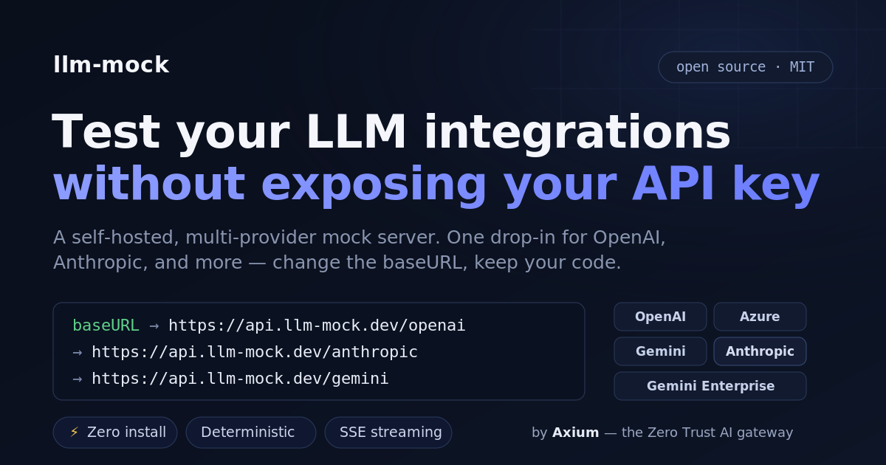

<p align="center">
  <a href="https://llm-mock.dev">
    
  </a>
</p>

# llm-mock

[](https://github.com/axium-lab/llm-mock/actions/workflows/ci.yml)
[](https://github.com/axium-lab/llm-mock/releases)
[](https://github.com/axium-lab/llm-mock/pkgs/container/llm-mock)
[](LICENSE)

**A drop-in mock of LLM provider APIs for integration tests and open source projects. Change the `baseURL`, keep your code.**

> **⚡ Zero install** — a free hosted instance runs at **[`api.llm-mock.dev`](https://api.llm-mock.dev)**. Point your SDK's `baseURL` there and start testing in seconds; no download, no signup. [Details ↓](#hosted-instance)

Testing an app built on an LLM SDK usually means one of two things: paying for real API calls in CI, or leaking an API key into a place it should never be (a public repo, a contributor's laptop, a CI log). llm-mock removes that choice. It is a tiny local server that speaks each provider's API contract — same endpoints, same response shapes, same error format, same SSE streaming — but with deterministic, configurable responses and no real key required. OpenAI, Anthropic, Gemini (AI Studio), Gemini Enterprise and Azure OpenAI are supported today.

```ts
import OpenAI from "openai";

const client = new OpenAI({
  baseURL: "http://localhost:3000/openai/v1", // the only change in your app
  apiKey: "sk-mock-key-01",                   // any key from api-keys.json
});

const completion = await client.chat.completions.create({
  model: "gpt-4o",
  messages: [{ role: "user", content: "Hello!" }],
});

console.log(completion.choices[0].message.content); // "Echo: Hello!"
```

No mocking libraries, no request interception, no changes to your application code. The official `openai` SDK talks to llm-mock exactly as it talks to the real API — that compatibility is what the project's own test suite verifies.

## Hosted instance

Nothing to install: a free, shared instance runs at **`https://api.llm-mock.dev`**. Point any OpenAI SDK's `baseURL` at it and go:

```ts
const client = new OpenAI({
  baseURL: "https://api.llm-mock.dev/openai/v1",
  apiKey: "sk-mock-key-01",
});
```

It's a stateless mock meant for demos and CI — it holds no data and requires no signup, and it ships the same `sk-mock-key-01` … `sk-mock-key-10` keys. For custom keys, isolation, or offline use, run your own (below). See the full [API reference](https://llm-mock.dev/api.html).

## Features

- **OpenAI-compatible contract** — responses match the official API shapes, validated in CI with the official `openai` npm SDK as the client.
- **Streaming (SSE)** — `stream: true` works on chat completions (delta chunks + `data: [DONE]`) and on the Responses API (typed events: `response.created`, `response.output_text.delta`, `response.completed`, ...).
- **Deterministic and idempotent** — same request, same bytes: ids are content hashes, timestamps derive from them, embeddings are hash-seeded unit vectors. Snapshot-test friendly.
- **Stateless canned responses** — need a specific reply? Send it in the `x-llm-mock-response` header of the request itself. Nothing to register, nothing to clean up, and no server state: it behaves identically on a laptop, in CI, or behind a load balancer.
- **Tool calls** — `tool_choice: "required"` (or a named function) returns real `tool_calls` with arguments synthesized from your JSON Schema, streaming included; pin exact ones with the `x-llm-mock-tool-calls` header. The loop terminates once a tool result is in the conversation. [Details ↓](#tool-calls)
- **Files without a store** — `multipart/form-data` uploads and the chunked Uploads API work, yet nothing is persisted: the returned id carries the file's metadata, so `create` → `retrieve` round-trips on any instance. [Details ↓](#files-and-uploads)
- **Real error flows** — invalid API keys, unknown models, and validation errors return the exact OpenAI error envelope, so you can test your error handling too.
- **Zero setup** — clone, `bun install`, `bun start`. The valid API keys ship in the repo.

## Quick start

Requires [Bun](https://bun.sh).

```bash
git clone https://github.com/axium-lab/llm-mock.git
cd llm-mock
bun install
bun start
```

```
llm-mock listening on http://localhost:3000
- openai: baseURL http://localhost:3000/openai/v1
- gemini: baseURL http://localhost:3000/gemini
10 valid API keys loaded from api-keys.json
```

Then point any OpenAI SDK at it:

```ts
const client = new OpenAI({ baseURL: "http://localhost:3000/openai/v1", apiKey: "sk-mock-key-01" });
```

```python
client = OpenAI(base_url="http://localhost:3000/openai/v1", api_key="sk-mock-key-01")
```

```bash
curl http://localhost:3000/openai/v1/chat/completions \
  -H "Authorization: Bearer sk-mock-key-01" \
  -H "Content-Type: application/json" \
  -d '{"model": "gpt-4o", "messages": [{"role": "user", "content": "ping"}]}'
```

### Run with Docker

No Bun installed? A prebuilt multi-arch image (amd64/arm64) is published on [GHCR](https://github.com/axium-lab/llm-mock/pkgs/container/llm-mock) with every release:

```bash
docker run --rm -p 3000:3000 ghcr.io/axium-lab/llm-mock
```

Available tags: `latest`, and `X.Y.Z` / `X.Y` per release (pin a version in CI, e.g. `ghcr.io/axium-lab/llm-mock:0.1.0`).

Or build it yourself from the repo:

```bash
docker build -t llm-mock .
docker run --rm -p 3000:3000 llm-mock
```

To use your own API keys file, mount it over the default one:

```bash
docker run --rm -p 3000:3000 -v ./my-keys.json:/app/api-keys.json:ro llm-mock
```

The image ships a `HEALTHCHECK`, so orchestrators (and `docker compose` `depends_on: condition: service_healthy`) know when the mock is ready.

## Provider support

llm-mock is designed to be multi-provider: each provider mounts under its own URL prefix and implements its own API contract. This is where each one stands today:

| Provider | Prefix | Status |
| --- | --- | --- |
| OpenAI | `/openai/v1` | ✅ Supported |
| Gemini (AI Studio) | `/gemini` | ✅ Supported — `generateContent`, Interactions API, embeddings, files, OpenAI-compat layer |
| Gemini Enterprise (ex-Vertex AI) | `/gemini-enterprise` | ✅ Supported — `generateContent`, Interactions API, streaming, tool calls, embeddings |
| Azure OpenAI | `/azure/openai` | ✅ Supported — chat completions, streaming, tool calls, embeddings, content filtering |
| Anthropic | `/anthropic` | ✅ Supported — messages, streaming, tool use, thinking, models, token counting, batches, files |

Note that where the version segment lives depends on the SDK, not on us. The OpenAI client appends only the request path, so its `baseURL` carries the version; `@google/genai` appends the version itself, so its `baseUrl` stops at the provider prefix:

```ts
new OpenAI({ baseURL: "http://localhost:3000/openai/v1", apiKey: "sk-mock-key-01" });
new GoogleGenAI({ apiKey: "sk-mock-key-01", httpOptions: { baseUrl: "http://localhost:3000/gemini" } });
```

Want a provider prioritized? [Open an issue](https://github.com/axium-lab/llm-mock/issues) — or a PR (see [Contributing](#contributing)).

## Supported endpoints

### OpenAI

| Endpoint | Notes |
| --- | --- |
| `POST /openai/v1/chat/completions` | Full `chat.completion` object, `n` choices, SSE streaming, `stream_options.include_usage` |
| `POST /openai/v1/responses` | Full `response` object, typed SSE event stream |
| `GET /openai/v1/responses/{id}` | Stateless: synthesizes a deterministic response for any id |
| `DELETE /openai/v1/responses/{id}` | Idempotent; returns the OpenAI deletion object |
| `GET /openai/v1/models` | Simulated catalog (`gpt-4.1`, `gpt-4o`, `gpt-4o-mini`, `text-embedding-3-*`, ...) |
| `GET /openai/v1/models/{model}` | `404` in OpenAI error format for unknown models |
| `POST /openai/v1/embeddings` | Deterministic unit vectors, correct dimension per model, `dimensions` param, `float` and `base64` encoding |
| `POST /openai/v1/files` | `multipart/form-data` upload; validates `purpose`, honors `expires_after` |
| `GET /openai/v1/files` | Simulated catalog with `purpose` filter, `limit`, `order` and `after` pagination |
| `GET /openai/v1/files/{id}` | Stateless: the id carries the file's metadata, so an upload round-trips exactly |
| `DELETE /openai/v1/files/{id}` | Idempotent; returns the OpenAI deletion object |
| `GET /openai/v1/files/{id}/content` | Deterministic placeholder bytes (valid JSONL for `fine-tune`/`batch` files) |
| `POST /openai/v1/uploads` | Creates a `pending` upload for the chunked flow |
| `POST /openai/v1/uploads/{id}/parts` | Accepts a part of up to 64 MB, named or nameless |
| `POST /openai/v1/uploads/{id}/complete` | Returns the upload as `completed` with the nested `file` object |
| `POST /openai/v1/uploads/{id}/cancel` | Returns the upload as `cancelled` |

Parameters the mock does not simulate (`temperature`, `top_p`, `response_format`, ...) are accepted without error, because real SDK clients send them. `tools` and `tool_choice` **are** simulated — see [Tool calls](#tool-calls).

### Gemini (AI Studio)

Both `v1beta` and `v1` serve the same mock, so either `apiVersion` works.

| Endpoint | Notes |
| --- | --- |
| `POST /gemini/v1beta/models/{model}:generateContent` | Full response: `candidates`, `finishReason`, `usageMetadata` split by modality, `modelVersion`, `responseId`. `candidateCount`, `systemInstruction`, `tools` and `toolConfig` are simulated |
| `POST /gemini/v1beta/models/{model}:streamGenerateContent` | SSE with `?alt=sse`, streamed JSON array without it |
| `POST /gemini/v1beta/models/{model}:batchEmbedContents` | Deterministic unit vectors; what the SDK calls even for one input |
| `POST /gemini/v1beta/models/{model}:embedContent` | The singular form, for curl and non-SDK callers |
| `POST /gemini/v1beta/models/{model}:countTokens` | Accepts bare `contents` or a whole `generateContentRequest` |
| `GET /gemini/v1beta/models` | Simulated catalog (`gemini-3.6-flash`, `gemini-3.1-pro-preview`, `gemini-3.5-flash-lite`, `gemini-embedding-001`, ...), ids checked against the live listing |
| `GET /gemini/v1beta/models/{model}` | `404` in Google's `google.rpc.Status` format for unknown models |
| `GET /gemini/v1beta/tunedModels` | Always empty; this mock mints no tuned models |
| `POST /gemini/v1beta/interactions` | Interactions API: `steps`, `usage`, `status`, tool calls and SSE with `stream: true` |
| `GET /gemini/v1beta/interactions/{id}` | Stateless: synthesizes a deterministic interaction for any id. `?stream=true` replays it as events |
| `POST /gemini/v1beta/interactions/{id}/cancel` | Returns the interaction as `cancelled` |
| `DELETE /gemini/v1beta/interactions/{id}` | Idempotent; `200` with an empty body, which is what the SDK expects |
| `POST /gemini/upload/v1beta/files` | Resumable upload, both steps. Note the `upload/` segment sits **before** the version |
| `GET /gemini/v1beta/files` | Simulated catalog with `pageSize`/`pageToken` pagination |
| `GET /gemini/v1beta/files/{name}` | Stateless: the name carries the file's metadata, so an upload round-trips exactly |
| `DELETE /gemini/v1beta/files/{name}` | Idempotent; returns `{}` |
| `POST /gemini/v1beta/openai/chat/completions` | OpenAI-compatibility layer, streaming and tool calls included |
| `POST /gemini/v1beta/openai/embeddings` | Same layer, at Gemini's dimensions |
| `GET /gemini/v1beta/openai/models` | Gemini's catalog in OpenAI's list envelope |

Custom methods are addressed the Google way, as `{resource}:{method}` — `models/gemini-3.6-flash:generateContent`. Those that are not implemented yet answer with the same `404` the real API returns for a method a model does not support.

```ts
import { GoogleGenAI } from "@google/genai";

const ai = new GoogleGenAI({
  apiKey: "sk-mock-key-01",
  httpOptions: { baseUrl: "http://localhost:3000/gemini" },
});

const response = await ai.models.generateContent({ model: "gemini-3.6-flash", contents: "Hello!" });
console.log(response.text); // "Echo: Hello!"
```

The `x-llm-mock-response` and `x-llm-mock-tool-calls` headers work here exactly as they do on OpenAI. Two differences are Gemini's, not ours: `toolConfig.functionCallingConfig.mode` replaces `tool_choice` (`ANY` forces a call, `NONE` forbids one, `AUTO` leaves it to a model this mock does not have), and a call's arguments arrive as a decoded `args` object instead of a JSON string. A streamed call is never split across chunks.

#### Interactions API

Google's next-generation surface, GA since June 2026 and the one its own quickstart now uses. It is a different contract from `generateContent`, not a wrapper: fields are `snake_case`, a turn is a `Step` rather than a `Content`, and errors use the flatter envelope shown under [Authentication](#authentication).

```ts
const interaction = await ai.interactions.create({ model: "gemini-3.6-flash", input: "Hello!" });
console.log(interaction.output_text); // "Echo: Hello!"
```

The mock stays stateless here, exactly as it does on OpenAI's Responses API: `create` never stores anything, and `GET /interactions/{id}` synthesizes a deterministic interaction for whatever id you ask for instead of returning a `404`. So `store`, `background` and `previous_interaction_id` are accepted and ignored — a test that depends on real server-side continuation is the one thing this endpoint cannot fake.

Note that `tool_choice` lives inside `generation_config` on this surface, not beside `tools`. Streaming emits `interaction.created` → `step.start` / `step.delta` / `step.stop` → `interaction.completed`, and a function call's arguments arrive as `arguments_delta` pieces of a JSON string — the one place this API re-encodes what it otherwise sends decoded.

#### Files

The full resumable protocol works, and still nothing is persisted:

```ts
const file = await ai.files.upload({
  file: new Blob(["hello"], { type: "text/plain" }),
  config: { mimeType: "text/plain", displayName: "notes.txt" },
});

const same = await ai.files.get({ name: file.name });  // round-trips exactly
```

Both halves stay stateless. The upload session has no server-side table behind it: the metadata declared at `start` travels back to the client inside the `x-goog-upload-url` it is told to use, and returns with the bytes. The file's own metadata then rides inside the name it is given, so a later `get` answers accurately on any instance. `sha256Hash` is the genuine digest of the bytes received, so a client that verifies it succeeds.

That makes minted names longer than the 40 characters Google documents. The cap applies to names a *client* supplies, not to ones the server returns — verified against `@google/genai`, which reads a 90-character name back without complaint. Reserve the `files/missing…` prefix to exercise the not-found path, which the real API reports as a `403 PERMISSION_DENIED` rather than a `404`.

#### OpenAI-compatibility layer

Google runs an OpenAI-shaped surface at `/v1beta/openai`, so an app built on the `openai` SDK can talk to Gemini by changing only its `baseURL`. The mock serves it too:

```ts
const client = new OpenAI({
  baseURL: "http://localhost:3000/gemini/v1beta/openai",
  apiKey: "sk-mock-key-01",
});

const completion = await client.chat.completions.create({
  model: "gemini-3.6-flash",
  messages: [{ role: "user", content: "Hello!" }],
});
```

It is a translation layer over the same backend, not a second API, so successful responses come back in OpenAI's shapes — `chat.completion` objects, `[DONE]`-terminated streams, tool call arguments as a JSON string rather than the decoded object the native surface sends. What it serves underneath is still Gemini, and that shows: `/models` lists Gemini models with `owned_by: "google"` and a `display_name` but no `created`, completions carry no `system_fingerprint` and no `chatcmpl-` id prefix, and embeddings come out at Gemini's dimensions rather than OpenAI's 1536.

**Errors are Google's, not OpenAI's.** The layer translates requests, not failures, so a client reading an otherwise OpenAI-shaped API gets `google.rpc.Status` back — and because the request has already become a `generateContent` call by the time it is validated, that is what the complaint names:

```jsonc
// POST /gemini/v1beta/openai/chat/completions  with no `messages`
{ "error": { "code": 400,
             "message": "* GenerateContentRequest.contents: contents is not specified\n",
             "status": "INVALID_ARGUMENT" } }
```

Only what Google actually exposes is mounted. **The Responses API and the Files endpoints are absent from the real compatibility layer**, so calling them here `404`s exactly as it would against Google — use `/openai/v1` for the former and Gemini's native `/gemini/v1beta/files` for the latter.

One known divergence: against the live API some errors on this layer and on `/interactions` come back wrapped in a JSON array (`[{"error":…}]`). The rule behind it was not determinable from the responses observed, so the mock always returns the bare object rather than guess.

### Gemini Enterprise (ex-Vertex AI)

Google renamed Vertex AI to the Gemini Enterprise Agent Platform; it serves the same model family as AI Studio but through a different contract. Both `v1beta1` (the SDK's default here) and `v1` are served.

| Endpoint | Notes |
| --- | --- |
| `POST /gemini-enterprise/v1beta1/publishers/google/models/{model}:generateContent` | Same contract as AI Studio, plus a `createTime` on every response |
| `POST /gemini-enterprise/v1beta1/publishers/google/models/{model}:streamGenerateContent` | SSE with `?alt=sse`, streamed JSON array without it |
| `POST /gemini-enterprise/v1beta1/publishers/google/models/{model}:predict` | Embeddings — this platform has no `:embedContent` |
| `POST /gemini-enterprise/v1beta1/publishers/google/models/{model}:countTokens` | Reports `totalTokens` only |
| `POST /gemini-enterprise/v1beta1/interactions` | Interactions API, same contract as AI Studio's. Also reachable on the encoded regional path |
| `GET`/`DELETE` `…/interactions/{id}`, `POST …/interactions/{id}/cancel` | Stateless, exactly as on the AI Studio surface |
| `GET /gemini-enterprise/v1beta1/publishers/google/models` | Publisher catalog, nested under `publisherModels` |
| `GET /gemini-enterprise/v1beta1/publishers/google/models/{model}` | `versionId` rather than `version`, and no token limits |
| `…/v1beta1/projects/{project}/locations/{location}/publishers/google/models/…` | The same router answers the regional path shape |

**Two authentication modes**, both accepted against the same `api-keys.json`. Express mode takes an API key in `x-goog-api-key` and addresses publisher models directly:

```ts
const ai = new GoogleGenAI({
  vertexai: true,
  apiKey: "sk-mock-key-01",
  httpOptions: { baseUrl: "http://localhost:3000/gemini-enterprise" },
});
```

Regional mode is how production code calls the platform — an OAuth token, and `projects/{p}/locations/{l}` in every path. The SDK will not emit a request without Application Default Credentials, so pointing it at a mock means handing it something that answers like an auth client:

```ts
const ai = new GoogleGenAI({
  vertexai: true,
  project: "my-project",
  location: "europe-west1",
  httpOptions: { baseUrl: "http://localhost:3000/gemini-enterprise" },
  googleAuthOptions: {
    authClient: {
      getRequestHeaders: async () => new Headers({ authorization: "Bearer sk-mock-key-01" }),
      getAccessToken: async () => ({ token: "sk-mock-key-01" }),
      request: async () => ({ data: {} }),
    } as never,
  },
});
```

A rejection differs by transport, matching the platform: a bad OAuth token is `401 UNAUTHENTICATED`, a bad API key `400 INVALID_ARGUMENT`. Unlike the AI Studio provider, none of this could be checked against the live service — it needs a GCP project with the platform enabled — so these shapes come from the official SDK's own types and transformers rather than from observed responses.

Embeddings are where the two Google surfaces diverge most. There is no `:embedContent` here: they ride the generic prediction endpoint, in an envelope that looks nothing like AI Studio's.

```jsonc
// POST …/publishers/google/models/text-embedding-005:predict
{ "instances": [{ "content": "hello", "task_type": "SEMANTIC_SIMILARITY" }],
  "parameters": { "outputDimensionality": 768 } }        // per call, not per instance

{ "predictions": [{ "embeddings": { "values": [ … ],
                                    "statistics": { "truncated": false, "token_count": 2 } } }] }
```

Note `task_type` and `token_count` in snake_case inside an otherwise camelCase API — that is the platform's own inconsistency, faithfully reproduced. `countTokens` here reports `totalTokens` and nothing else, where AI Studio's also breaks the count down by modality.

The Interactions API is served here too, on the same contract as AI Studio's — but reached through a path this platform builds oddly. In regional mode the SDK folds the entire version component, project and location included, into one percent-encoded path segment:

```
express    /gemini-enterprise/v1beta1/interactions
regional   /gemini-enterprise/v1beta1%2Fprojects%2F{project}%2Flocations%2F{location}/interactions
```

Express routes on the still-encoded path, so a literal `/v1beta1` mount never sees the second form; a route parameter does, and receives it decoded. Both shapes reach the same handler.

There is no Files API here, and that is the platform's doing rather than a gap in the mock: `@google/genai` refuses the upload client-side with *"Gemini Enterprise Agent Platform (previously known as Vertex AI) does not support uploading files. You can share files through a GCS bucket."*

### Azure OpenAI

Azure serves the same models as OpenAI through a different front door. Most of the differences are in the routing rather than the payloads — the exception being content filtering, which Azure adds to every response.

| Endpoint | Notes |
| --- | --- |
| `POST …/openai/deployments/{deployment}/chat/completions` | Full `chat.completion` object, SSE streaming with `[DONE]`, tool calls |
| `POST …/openai/deployments/{deployment}/embeddings` | Deterministic unit vectors, correct dimension per model |
| `…/openai/deployments/{deployment}/…?api-version=` | The classic surface. A **deployment name replaces the model** in the path, and `api-version` is required on every call |
| `POST /azure/openai/v1/chat/completions` | The newer surface: OpenAI's contract verbatim, no `api-version`, no deployments |
| `POST /azure/openai/v1/embeddings` | Same handlers as the deployment path, addressed by model |
| `GET /azure/openai/models?api-version=` | Model catalog, outside the deployment path |

Azure puts the resource name in the hostname (`{resource}.openai.azure.com`) and keeps `/openai` in the path. A mock cannot hand out subdomains, but it does not need to — the SDK takes an arbitrary URL:

```ts
import { AzureOpenAI } from "openai";

const client = new AzureOpenAI({
  baseURL: "http://localhost:3000/azure/openai",
  apiKey: "sk-mock-key-01",
  apiVersion: "2024-10-21",
});
```

Use `baseURL` rather than `endpoint`: the SDK reads `OPENAI_BASE_URL` from the environment and then refuses to combine it with `endpoint`, so a stray env var would break the client before it sends anything.

The v1 surface needs no Azure-specific client at all — a plain `OpenAI` pointed one level deeper:

```ts
const client = new OpenAI({
  baseURL: "http://localhost:3000/azure/openai/v1",
  apiKey: "sk-mock-key-01",
});
```

Both surfaces run the same handlers, so the same request returns the same body on either. The reserved `missing-` prefix belongs to the deployment path only: on v1 there is no deployment to be missing, and `missing-one` is just a model name.

**Deployments.** Any name works, the way every provider here accepts any model id — except names starting with `missing-`, which return the real `404 DeploymentNotFound`. That is the error Azure users hit most, and the one their code most needs to handle. The deployment routes the call; the `model` echoed back is the one the client asked for, since the two need not agree.

**Authentication** takes the key in an `api-key` header rather than a bearer token, which is the single most common reason an OpenAI-shaped client fails against Azure. `Authorization: Bearer` is accepted too, as Entra ID callers use it. The two failures answer differently, and that is Azure's own doing: a missing key is rejected by the API gateway in a flatter shape with no `error` wrapper, while an invalid one gets the wrapped envelope.

#### Content filtering

The most Azure-specific thing about the service, and the reason an OpenAI-shaped client can meet a response it did not expect. Every chat completion carries the filter's verdict — on the prompt at the top level, on each choice individually:

```jsonc
{
  "choices": [{
    "message": { "content": "Echo: hello" },
    "finish_reason": "stop",
    "content_filter_results": {
      "hate":      { "filtered": false, "severity": "safe" },
      "self_harm": { "filtered": false, "severity": "safe" },
      "sexual":    { "filtered": false, "severity": "safe" },
      "violence":  { "filtered": false, "severity": "safe" }
    }
  }],
  "prompt_filter_results": [{
    "prompt_index": 0,
    "content_filter_results": { /* the four above, plus binary detectors */
      "jailbreak": { "filtered": false, "detected": false } }
  }]
}
```

To exercise the failure paths, pin the verdict with `x-llm-mock-content-filter`, as `<target>` or `<target>:<category>:<severity>`:

| Value | Result |
| --- | --- |
| `prompt` | `400` with `code: "content_filter"`, and the verdict nested in `innererror` |
| `completion` | `200` with `content: null` and `finish_reason: "content_filter"` |
| `unavailable` | `200`, with an `error` object where the verdict would be — the documented "filter did not run" case |

Categories are `hate`, `self_harm`, `sexual`, `violence` and `jailbreak`; severities `safe`, `low`, `medium`, `high`. So `completion:violence:high` filters the reply and says which category did it.

Two quirks are reproduced deliberately, because code written against OpenAI trips on both. A **streamed response opens with a chunk carrying no choices at all**, just the prompt's verdict — a client reaching straight for `chunk.choices[0]` breaks there. And the blocked-prompt error nests its verdict under `content_filter_result`, **singular**, against the plural used everywhere else.

None of this provider's shapes could be checked against a live Azure resource. Its routes come from observing what `AzureOpenAI` puts on the wire, and its payloads from Microsoft's documentation and published examples — but they are not observed responses. The empty first streaming chunk in particular is reconstructed from reported behaviour rather than seen.

### Anthropic

This is the one provider here that shares nothing structural with OpenAI: everything goes through a single `POST /v1/messages`, responses are lists of typed content blocks, and the system prompt is a top-level field rather than a message.

| Endpoint | Notes |
| --- | --- |
| `POST /anthropic/v1/messages` | The whole generative surface: content blocks, `system`, tool use, thinking, `stop_reason`, `usage`, and SSE with `stream: true` |
| `POST /anthropic/v1/messages/count_tokens` | What a prompt costs before you send it |
| `POST /anthropic/v1/messages/batches` | Half-price asynchronous batch of message requests |
| `GET /anthropic/v1/messages/batches` | Always an empty page — a stateless mock keeps no list |
| `GET /anthropic/v1/messages/batches/{id}` | Status and per-request counts |
| `GET /anthropic/v1/messages/batches/{id}/results` | JSONL, one result per line, keyed by `custom_id` |
| `POST /anthropic/v1/messages/batches/{id}/cancel` | Moves the batch to `canceling` |
| `DELETE /anthropic/v1/messages/batches/{id}` | Returns `message_batch_deleted` |
| `GET /anthropic/v1/models` | Simulated catalog, cursor-paginated by `after_id`/`before_id` |
| `GET /anthropic/v1/models/{id}` | `max_input_tokens` is the context window; `capabilities` is a nested tree of supported flags |
| `POST /anthropic/v1/files` | Multipart upload, beta-gated |
| `GET /anthropic/v1/files` | Simulated catalog, same id cursor, filterable by `scope_id` |
| `GET /anthropic/v1/files/{id}` | Metadata: `filename`, `mime_type`, `size_bytes`, `downloadable` |
| `GET /anthropic/v1/files/{id}/content` | Only for files the API produced itself |
| `DELETE /anthropic/v1/files/{id}` | Returns `file_deleted` |

```ts
import Anthropic from "@anthropic-ai/sdk";

const client = new Anthropic({
  apiKey: "sk-mock-key-01",
  baseURL: "http://localhost:3000/anthropic",
});
```

Three things differ from every other provider on this server, and all three are the API's own doing:

- **The credential travels in `x-api-key`, not a bearer token.** `Authorization: Bearer` is accepted too, as OAuth callers use it.
- **`anthropic-version` is required on every request.** Any value is accepted — validating against a list of known versions would mean maintaining that list and guessing at versions that do not exist yet. A missing header is a `400`, which is the classic failure when calling this API by hand.
- **The error envelope wraps twice and echoes the request id**, and it is the only one here that uses HTTP `529`:

```json
{
  "type": "error",
  "error": { "type": "authentication_error", "message": "invalid x-api-key" },
  "request_id": "req_011CSHoEeqs5C35K2UUqR7Fy"
}
```

The `request_id` matches the `x-request-id` response header, as it does on the real API. Error types are `invalid_request_error`, `authentication_error`, `permission_error`, `not_found_error`, `request_too_large`, `rate_limit_error`, `api_error` and `overloaded_error` (`529`).

#### Messages

```ts
const message = await client.messages.create({
  model: "claude-opus-5",
  max_tokens: 1024,
  system: "You are terse.",
  messages: [{ role: "user", content: "Hello!" }],
});

message.content; // [{ type: "text", text: "Echo: Hello!", citations: null }]
```

Four shapes here differ from the other providers, and they are the API's, not the mock's:

- **`max_tokens` is required.** Omitting it is a `400`, where every other provider defaults it.
- **`system` is a top-level field**, not a message with `role: "system"`. It counts towards `input_tokens`.
- **Tool calls are content blocks.** A `tool_use` block carries a decoded `input` object (not OpenAI's JSON string) and an id prefixed `toolu_`; the result comes back as a `tool_result` block inside a **user** message. `tool_choice` is an object — `{type:"any"}` forces a call, `{type:"tool",name}` names one, `{type:"none"}` forbids them, and the default `auto` leaves it to a model this mock does not have.
- **Thinking blocks are emitted whenever thinking is on**, but `display` decides whether they carry text: the default `"omitted"` leaves `thinking` an empty string, and `"summarized"` fills in a summary. That empty-but-present block is what a streaming UI sees as a long pause, so it is worth being able to test.

Consecutive same-role messages are accepted — the real API combines them into one turn — but the conversation must open with `user`. The `x-llm-mock-response` and `x-llm-mock-tool-calls` headers work exactly as on the other providers.

**Streaming uses named SSE events**, and this is the sharpest divergence on the whole server. Every frame carries an `event:` line as well as `data:`, and there is no sentinel string — the stream ends on a named `message_stop`:

```
event: message_start
data: {"type":"message_start","message":{…,"content":[],"stop_reason":null}}

event: content_block_delta
data: {"type":"content_block_delta","index":0,"delta":{"type":"text_delta","text":"Echo: "}}

event: message_stop
data: {"type":"message_stop"}
```

Both halves are load-bearing, verified against the real client: drop the `event:` lines and the SDK reads **zero** chunks; drop `message_stop` and it errors with *"stream ended without producing a Message"*. That makes three SSE conventions across the five providers here:

| Provider | Frame | Terminator |
| --- | --- | --- |
| OpenAI, Azure | `data:` only | `data: [DONE]` |
| Gemini, Gemini Enterprise | `data:` only | end of stream (a `[DONE]` is rejected) |
| Anthropic | `event:` **and** `data:` | `event: message_stop` |

A tool call streams its arguments as `input_json_delta` pieces of a JSON string, and a thinking block streams `thinking_delta` pieces followed by its `signature` under a separate `signature_delta`.

#### Token counting

```ts
const { input_tokens } = await client.messages.countTokens({
  model: "claude-opus-5",
  system: "You are terse.",
  messages: [{ role: "user", content: "Hello!" }],
});
```

The count adds up the messages, the system prompt and the serialized tool declarations, exactly the way `/v1/messages` builds its `usage.input_tokens` — so counting a prompt and then sending it gives the same number twice. It is an approximation, like every token count on this server; what it is good for is asserting that a prompt got bigger or smaller, not that it costs 412 tokens.

#### Batches

```ts
const batch = await client.messages.batches.create({
  requests: [
    { custom_id: "a", params: { model: "claude-opus-5", max_tokens: 64, messages: [{ role: "user", content: "one" }] } },
    { custom_id: "b", params: { model: "claude-opus-5", max_tokens: 64, messages: [{ role: "user", content: "two" }] } },
  ],
});

for await (const result of await client.messages.batches.results(batch.id)) {
  result.custom_id;         // "a"
  result.result.type;       // "succeeded"
  result.result.message;    // a full Message, echoing that request's prompt
}
```

A batch is created by one request and read back by several others, which normally needs a store — and this server never keeps one. **The batch rides inside its own id**, the same trick the Files endpoints use: `msgbatch_` followed by the base64url of the `custom_id`, model and prompt of every request. Retrieve, results, cancel and delete all just decode it, so they work across restarts and across processes.

That has one visible consequence, and it is deliberate that you see it rather than not: an id travels in a URL, so it cannot grow forever. Past roughly 1600 characters — a few dozen short requests — creating the batch fails with a `400` that says exactly that, instead of quietly dropping requests. The real API takes 100,000 of them; if you need that shape, you are testing the API, not your code.

**Batches complete instantly.** With no clock to advance and no state to advance it in, a new batch is already `ended` and its results are already there. When you need to exercise the polling branch — the one that reads `processing_status` and waits — pin the status with `x-llm-mock-batch-status: in_progress` (or `canceling`, or `ended`). A batch that has not ended has a null `results_url` and its results endpoint answers `400`, the same as the real one.

#### Files

```ts
const file = await client.beta.files.upload({
  file: await toFile(Buffer.from("hello"), "notes.txt", { type: "text/plain" }),
});

await client.beta.messages.create({
  model: "claude-opus-5",
  max_tokens: 1024,
  betas: ["files-api-2025-04-14"],
  messages: [{ role: "user", content: [{ type: "document", source: { type: "file", file_id: file.id } }] }],
});
```

Uploaded files carry their metadata **inside the id they are minted**, so an upload round-trips to a retrieve with nothing stored — the same trick used for OpenAI files, Gemini files and Anthropic batches. Same bytes and same name give the same id, so a test can assert on it. `file_missing…` is reserved and always `404`s; a foreign-looking id resolves to a plausible synthetic file rather than an error, so ids copied out of production logs still behave.

**The beta flag is part of the contract.** Every call has to carry `anthropic-beta: files-api-2025-04-14`, and a call without it is a `400` that says so. The header may list several betas comma-separated, or be repeated — both are accepted. The SDK also appends `?beta=true` to the path, which is its own routing artefact; the mock does not require it.

**A file you uploaded cannot be downloaded**, on the real API and here: `GET /content` on one answers `403`. Only files the API produced itself — code execution output — can be read back, so the simulated catalog carries two of those to make the download path testable at all. Their bytes are a deterministic placeholder, and `x-llm-mock-response` pins them.

A message whose only content is a file attachment echoes the attachment: `Echo: [file_mock_report_pdf]`. Without that, a prose-less turn would fall through to the generic greeting and there would be no way to assert that the reference reached the server.

**Managed Agents is out of scope** — the `/v1/agents`, `/v1/sessions`, `/v1/environments`, `/v1/vaults` and `/v1/memory_stores` surface is not mocked. That is a deliberate decision, not an oversight: it is larger than everything else on this provider combined.

### Mock-only

| Endpoint | Notes |
| --- | --- |
| `GET /health` | Healthcheck, outside any provider contract |

## Authentication

llm-mock validates API keys against a closed set defined in [`api-keys.json`](api-keys.json), so you can test both the happy path and the failure path:

- **Valid keys**: `sk-mock-key-01` through `sk-mock-key-10` ship in the repo. Point the file somewhere else with `LLM_MOCK_API_KEYS_FILE` to use your own.
- **Invalid keys**: any other key — by convention use the documented `sk-mock-invalid`.

The key set is shared by every provider, so the same `sk-mock-key-01` works everywhere; what changes is **where the key travels** and **what a rejection looks like**, and both mirror the real provider.

OpenAI reads `Authorization: Bearer` and rejects with a `401`:

```json
{
  "error": {
    "message": "Incorrect API key provided: sk-moc****alid. You can find your API key at https://platform.openai.com/account/api-keys.",
    "type": "invalid_request_error",
    "param": null,
    "code": "invalid_api_key"
  }
}
```

Gemini reads `x-goog-api-key` (with `?key=` and `Authorization: Bearer` also accepted, as the real API does) and reports a bad key as a `400`, not a `401`:

```json
{
  "error": {
    "code": 400,
    "message": "API key not valid. Please pass a valid API key.",
    "status": "INVALID_ARGUMENT",
    "details": [
      {
        "@type": "type.googleapis.com/google.rpc.ErrorInfo",
        "reason": "API_KEY_INVALID",
        "domain": "googleapis.com",
        "metadata": { "service": "generativelanguage.googleapis.com" }
      },
      {
        "@type": "type.googleapis.com/google.rpc.LocalizedMessage",
        "locale": "en-US",
        "message": "API key not valid. Please pass a valid API key."
      }
    ]
  }
}
```

An invalid key is the **only** error that carries `details`; every other one — missing credential, unknown model, unknown file, a malformed body — reports `code`/`message`/`status` and nothing more.

Credential handling varies by surface, and all three were checked against the live API:

| | Invalid key | No credential |
| --- | --- | --- |
| Native (`/v1beta/…`) | `400 INVALID_ARGUMENT` | `403 PERMISSION_DENIED` |
| `/v1beta/interactions` | `400 INVALID_ARGUMENT`, **classic** envelope | `403 PERMISSION_DENIED`, classic |
| `/v1beta/openai/…` | `400`, message `Please pass a valid API key`, no details | `404 NOT_FOUND` |

The Interactions row is the surprising one: that surface uses the flatter next-gen envelope for its own errors, but a credential is rejected by Google's frontend before the service ever runs, so an auth failure there comes back as `google.rpc.Status` like everywhere else.

## Controlling responses

By default every completion echoes the last user message (`"Echo: <your prompt>"`), which is deterministic and lets tests assert that their exact prompt reached the server. When a test needs a specific reply, the request itself carries it in a header — nothing to register beforehand, nothing to clean up afterwards:

```ts
const completion = await client.chat.completions.create(
  { model: "gpt-4o", messages: [{ role: "user", content: "What's the weather like?" }] },
  { headers: { "x-llm-mock-response": "It is sunny in Valencia." } },
);
// completion.choices[0].message.content === "It is sunny in Valencia."
```

```python
completion = client.chat.completions.create(
    model="gpt-4o",
    messages=[{"role": "user", "content": "What's the weather like?"}],
    extra_headers={"x-llm-mock-response": "It is sunny in Valencia."},
)
```

HTTP headers cannot carry UTF-8 verbatim; for content beyond ASCII, base64-encode it into `x-llm-mock-response-base64` (which wins when both headers are present):

```ts
{ headers: { "x-llm-mock-response-base64": Buffer.from("Soleado — 30°C ☀️").toString("base64") } }
```

Because the canned response travels with the request, the server keeps no state at all: the same request always returns the same response, no matter which instance, replica, or restart serves it.

## Tool calls

The mock answers with tool calls in two situations, so an agent loop can be exercised end to end without a real model.

**1. `tool_choice` demands one.** With `"required"` the first declared tool is called; with `{ type: "function", function: { name } }` (Chat Completions) or `{ type: "function", name }` (Responses) that tool is called. `"auto"` and `"none"` answer with text, because deciding to call a tool is the one thing a mock cannot do. Arguments are synthesized from the tool's JSON Schema — `default` first, then the first `enum` value, then a placeholder per type — filling the `required` properties, or all of them when the schema declares no `required`.

```ts
const completion = await client.chat.completions.create({
  model: "gpt-4o",
  messages: [{ role: "user", content: "Weather in Valencia?" }],
  tools: [{ type: "function", function: { name: "get_weather", parameters: schema } }],
  tool_choice: "required",
});
// finish_reason === "tool_calls", message.content === null
// tool_calls[0].function === { name: "get_weather", arguments: '{"city":"mock","unit":"celsius"}' }
```

**2. The request pins them** in `x-llm-mock-tool-calls`, a JSON array (a bare object is taken as a single call) that overrides `tool_choice`. Omit `arguments` to have them synthesized from the schema; pass an object to encode it, or a string to send it verbatim — which is how you pin malformed arguments to test your own error handling:

```ts
const completion = await client.chat.completions.create(
  { model: "gpt-4o", messages: [{ role: "user", content: "Weather?" }] },
  {
    headers: {
      "x-llm-mock-tool-calls": JSON.stringify([
        { name: "get_weather", arguments: { city: "Valencia", unit: "celsius" } },
      ]),
    },
  },
);
```

Listing several entries produces parallel tool calls, each with its own id.

**The loop terminates.** Once the conversation carries a tool result — a `role: "tool"` message in Chat Completions, a `function_call_output` item in the Responses API — `tool_choice` stops forcing calls and the mock answers with text, so the second turn of an agent loop ends instead of calling the same tool forever. The explicit header still wins if you want a call anyway.

Both APIs stream tool calls too: Chat Completions emits `delta.tool_calls` pieces keyed by `index` and closes with `finish_reason: "tool_calls"`; the Responses API emits a `function_call` output item with `response.function_call_arguments.delta` / `.done` events. The Responses API also echoes the `tools` and `tool_choice` it received.

## Files and uploads

Files are the one part of the OpenAI contract that is inherently stateful, and llm-mock stores nothing. Instead of a server-side store, **the id carries the metadata**: `POST /files` encodes the filename, size and purpose into the id it returns, so a later `retrieve` answers accurately without anything having been kept — on any instance, after any restart.

```ts
const file = await client.files.create({
  file: await toFile(Buffer.from('{"prompt":"hi"}\n'), "training.jsonl"),
  purpose: "fine-tune",
});
// file.filename === "training.jsonl", file.bytes === 16

const same = await client.files.retrieve(file.id); // identical object, no state involved
```

The chunked [Uploads API](https://platform.openai.com/docs/api-reference/uploads) works the same way, so `complete` echoes back what `create` was told:

```ts
const upload = await client.uploads.create({
  filename: "training-examples.jsonl",
  bytes: 2048,
  mime_type: "text/jsonl",
  purpose: "fine-tune",
});
const part = await client.uploads.parts.create(upload.id, { data: new Blob([chunk]) });
const done = await client.uploads.complete(upload.id, { part_ids: [part.id] });
// done.status === "completed", done.file.filename === "training-examples.jsonl"
```

What this costs, and how to work with it:

- **Uploads do not appear in `GET /files`.** That endpoint returns a fixed simulated catalog — `file-mock-training-jsonl`, `file-mock-validation-jsonl`, `file-mock-manual-pdf`, `file-mock-batch-input`, `file-mock-diagram-png` — the same way `GET /models` returns a fixed model catalog. Use it to exercise listing, the `purpose` filter and `limit`/`after` pagination.
- **`GET /files/{id}/content` returns placeholder bytes**, not what you uploaded: valid JSONL for `fine-tune`/`batch` files, a text marker otherwise. To pin exact bytes, send them in `x-llm-mock-response` on the content request.
- **Any well-formed id resolves.** Since the mock cannot know what exists, ids it did not mint get plausible synthetic metadata. To test a 404, use a reserved id: anything starting with `file-missing` or `upload_missing` is always reported as not found, just like the known-invalid `sk-mock-invalid` API key.
- **Deletion is idempotent** and always reports `deleted: true`; there is nothing to remove.

## Configuration

Everything is optional — llm-mock works out of the box. To override the defaults, set environment variables or copy [`.env.example`](.env.example) to `.env` (Bun loads it automatically, no dotenv needed).

| Environment variable | Default | Description |
| --- | --- | --- |
| `LLM_MOCK_PORT` (or `PORT`) | `3000` | Port to listen on |
| `LLM_MOCK_API_KEYS_FILE` | `api-keys.json` | Path to the JSON array of valid API keys |

## Using it in your test suite

Import the app factory directly and mount it on an ephemeral port — no separate process needed. This is exactly how llm-mock tests itself:

```ts
import OpenAI from "openai";
import { createApp } from "llm-mock/src/app";
import { loadApiKeys } from "llm-mock/src/core/api-keys";

const server = createApp({ apiKeys: loadApiKeys("api-keys.json") }).listen(0);
const { port } = server.address();
const client = new OpenAI({ apiKey: "sk-mock-key-01", baseURL: `http://127.0.0.1:${port}/openai/v1` });
```

## Development

```bash
bun run dev        # start with file watching
bun test           # integration tests (official openai SDK as the client)
bun run typecheck  # tsc --noEmit
```

Stack: [Bun](https://bun.sh) + TypeScript + [Express](https://expressjs.com). The server holds no state — identical requests produce identical responses across restarts and replicas.

## Contributing

Issues and PRs are welcome. The one hard rule: every endpoint must keep working against the official `openai` SDK — add or extend an integration test in [`tests/`](tests/) that proves it.

## License

[MIT](LICENSE)
